# 공개처형

---

# 우당탕탕 Svelte 도전기

---

# React 개발자가 본 Svelte

---

# Why Svelte?

---

# 개발자들은 정말 `Svelte`를 좋아할까?

---

## :: State of JS 2022 설문조사

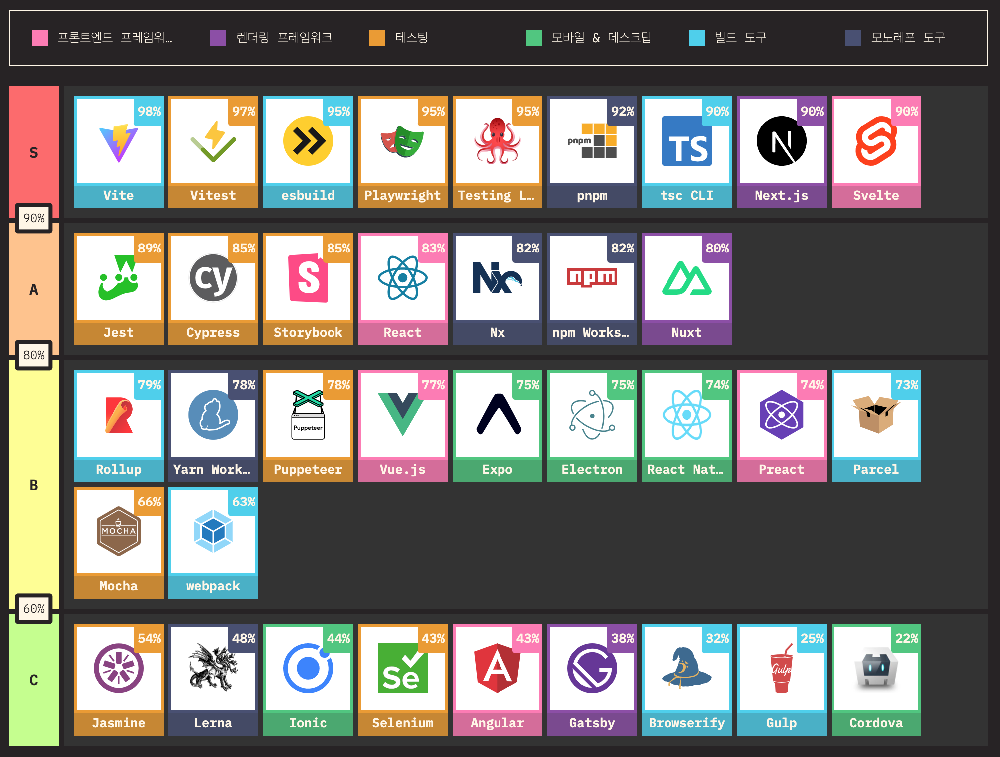

---

## :: State of JS 2022 설문조사

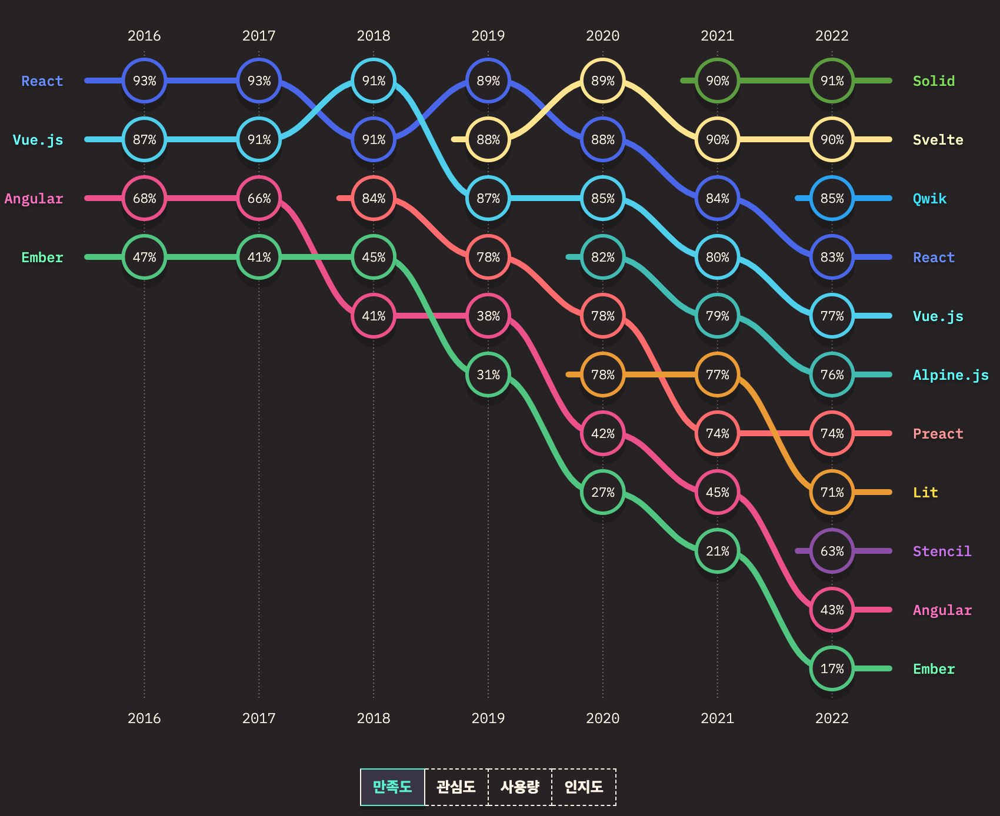

---

## :: State of JS 2022 설문조사

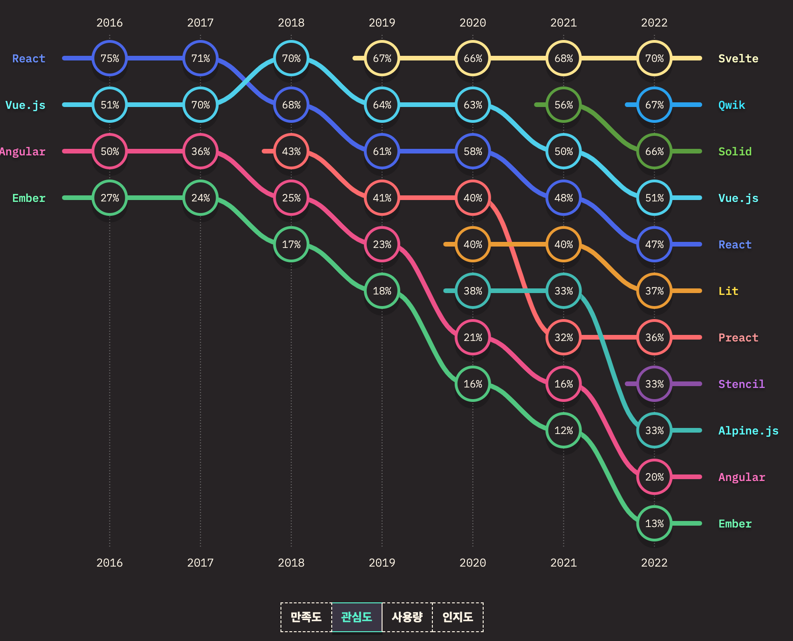

---

## :: State of JS 2022 설문조사

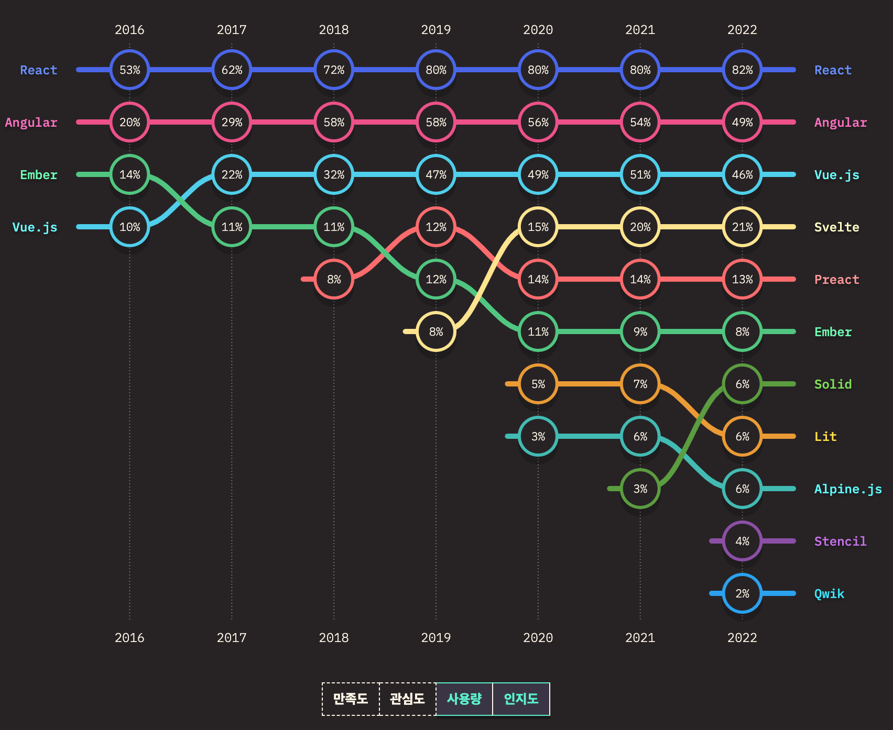

---

## :: State of JS 2022 설문조사

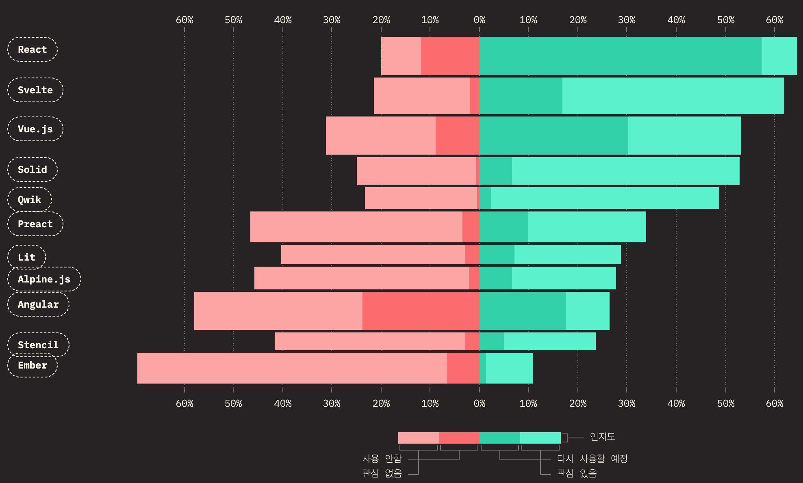

---

## :: Stack overflow 2022 설문조사

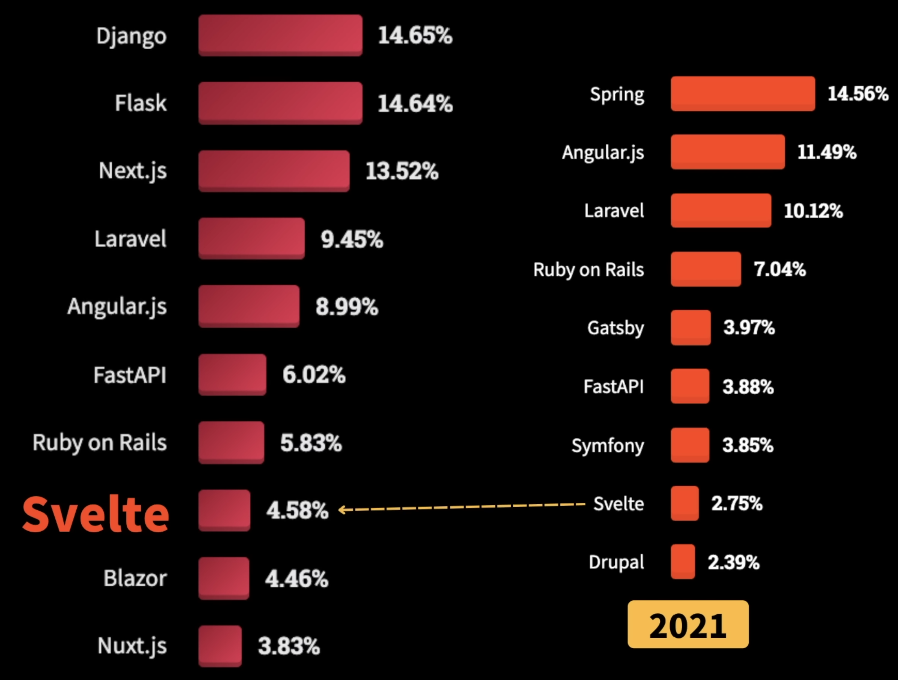

---

## :: Stack overflow 2022 설문조사

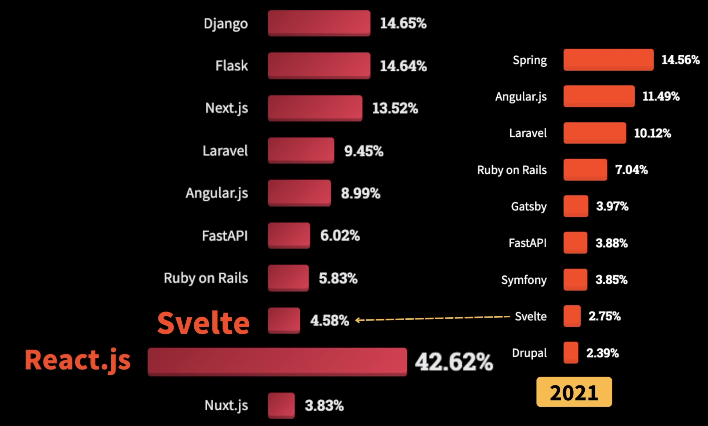

---


---

> 아무리 좋은 기술이더라도 사용할 이유가 **필요에 의해**서가 아닌 남들의 평가때문이라면 절대 우리 기술이 될 수 없다.

---

> 아무리 좋은 기술이더라도 사용할 이유가 **필요에 의해**서가 아닌 남들의 평가때문이라면 절대 우리 기술이 될 수 없다.

### - JayD.Kang -

---

## SPA(Single Page Application) **vs.** MPA(Multi Page Application)

---

<!--
_header: "MPA(Multi Page Application)"
-->


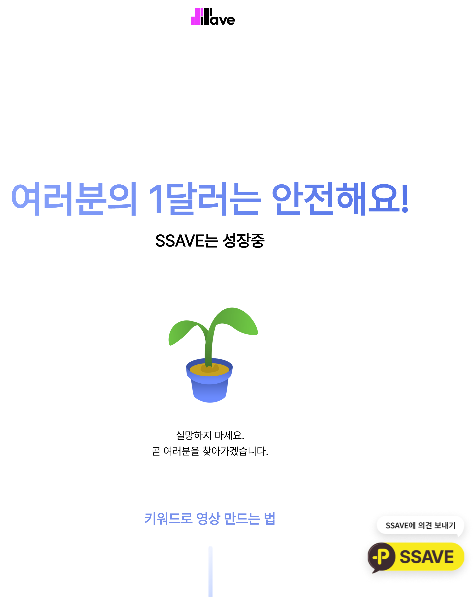

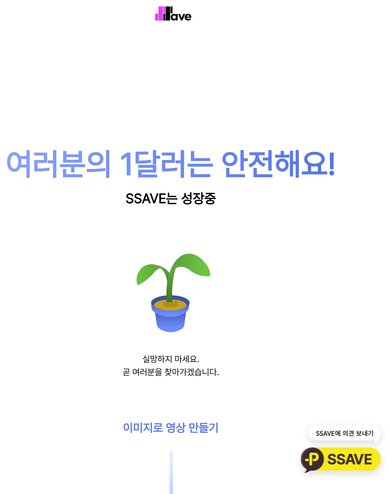

---

<!--
_header: "MPA(Multi Page Application)"
-->

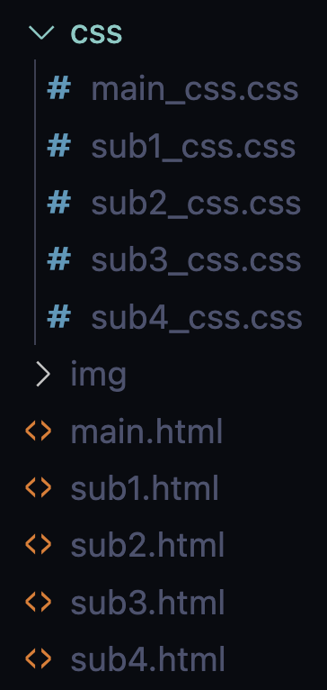

```html
<header id="header">
  <div class="logo">
    <a href="main.html">
      
    </a>
  </div>
</header>
<section id="section01">
  <div class="section01_flex">
    <div class="main_title_h1">여러분의 1달러는 안전해요!</div>
    <div class="section01_flex_inside">
      <div class="main_title_h2">SSAVE는 성장중</div>
      <div class="plant"></div>
      <div class="main_title_h3">
        실망하지 마세요.<br />곧 여러분을 찾아가겠습니다.
      </div>
    </div>
  </div>
</section>
<div class="scroll"></div>
```

```html
<header id="header">
  <div class="logo">
    <a href="main.html">
      
    </a>
  </div>
</header>
<section id="section01">
  <div class="section01_flex">
    <div class="main_title_h1">여러분의 1달러는 안전해요!</div>
    <div class="section01_flex_inside">
      <div class="main_title_h2">SSAVE는 성장중</div>
      <div class="plant"></div>
      <div class="main_title_h3">
        실망하지 마세요.<br />곧 여러분을 찾아가겠습니다.
      </div>
    </div>
  </div>
</section>
<div class="scroll"></div>
```

---

<!--
_header: "MPA(Multi Page Application)"
-->

**id = 1 or 2 or 3 or 4**

```html
<header id="header">
  <div class="logo">
    <a href="main.html">
      
    </a>
  </div>
</header>
<section id="section01">
  <div class="section01_flex">
    <div class="main_title_h1">여러분의 1달러는 안전해요!</div>
    <div class="section01_flex_inside">
      <div class="main_title_h2">SSAVE는 성장중</div>
      <div class="plant"></div>
      <div class="main_title_h3">
        실망하지 마세요.<br />곧 여러분을 찾아가겠습니다.
      </div>
    </div>
  </div>
</section>
<div class="scroll"></div>
```

---

<!--
_header: "SPA(Single Page Application)"
-->

### :: 명령형 프로그래밍

```javascript
const pathname = window.location.pathname;

const pathList = pathname.substring(1).split("/");

const idIndex = pathList.findIndex((path) => path === "service") + 1;

const id = pathList[idIndex];

const header = document.createElement("header");
const logoContainer = document.createElement("div");
const logoLink = document.createElement("a");
const logo = document.createElement("img");

logo[src] = "img/logo.svg";
logo[alt] = "title_logo'";

logoLink.appendChild(logo);
logoContainer.appendChild(logoLink);
header.appendChild(logoContainer);

//...
```

---

<!--
_header: "SPA(Single Page Application)"
-->

### :: 선언형 프로그래밍 (`React.js`)

```javascript
import { useRouter } from "next/router";

export default function Service() {
  const router = useRouter();

  const { id } = router.query;

  return (
    <>
      <header id="header">
        <div class="logo">
          <a href="main.html">
            
          </a>
        </div>
      </header>
      // ...
      <div class="scroll">
        
      </div>
    </>
  );
}
```

---

<!--
_header: "SPA(Single Page Application)"
-->

### :: 선언형 프로그래밍 (`Svelte`)

```html
<script>
  import { params } from "@roxi/routify";

  const { id } = $params;
</script>

<header id="header">
  <div class="logo">
    <a href="main.html">
      
    </a>
  </div>
</header>
// ...
<div class="scroll"></div>
```

---

# React **vs.** Svelte

---

## :: React **vs.** Svelte

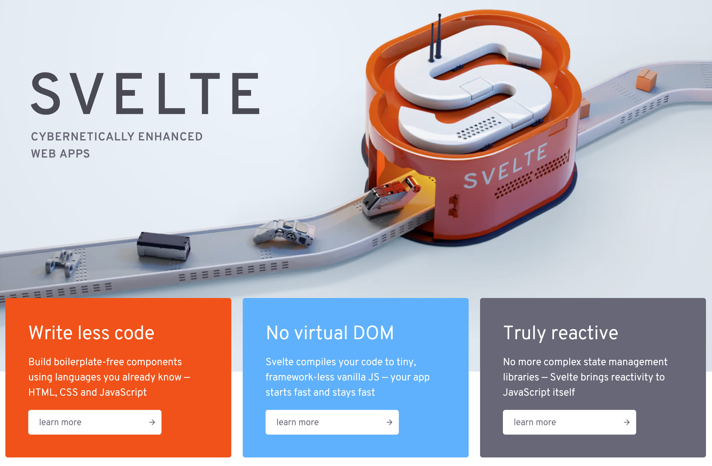

---

## :: React **vs.** Svelte

## 1. Write less code

- 높은 가독성 유지
- 개발 시간 단축
- 쉬운 리팩터링
- 쉬운 디버깅
- 더 작은 번들(SPA 최적화, 최초 로딩시 리소스가 많이 필요한 단점을 보완할 수 있다.)
- 낮은 러닝 커브

---

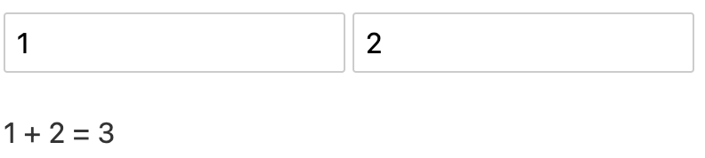

---

## :: React

```javascript
import { useState } from "react";

export default () => {
  const [a, setA] = useState(1);
  const [b, setB] = useState(2);

  function handleChangeA(event) {
    setA(+event.target.value);
  }

  function handleChangeB(event) {
    setB(+event.target.value);
  }

  return (
    <div>
      <input type="number" value={a} onChange={handleChangeA} />
      <input type="number" value={b} onChange={handleChangeB} />

      <p>
        {a} + {b} = {a + b}
      </p>
    </div>
  );
};
```

---

## :: Svelte

```html
<script>
  let a = 1;
  let b = 2;
</script>

<input type="number" bind:value="{a}" />
<input type="number" bind:value="{b}" />

<p>{a} + {b} = {a + b}</p>
```

---

## :: React **vs.** Svelte

### 1. Write less code

- 높은 가독성 유지
- 개발 시간 단축
- 쉬운 리팩터링
- 쉬운 디버깅
- 더 작은 번들(SPA 최적화, 최초 로딩시 리소스가 많이 필요한 단점을 보완할 수 있다.)
- 낮은 러닝 커브

---

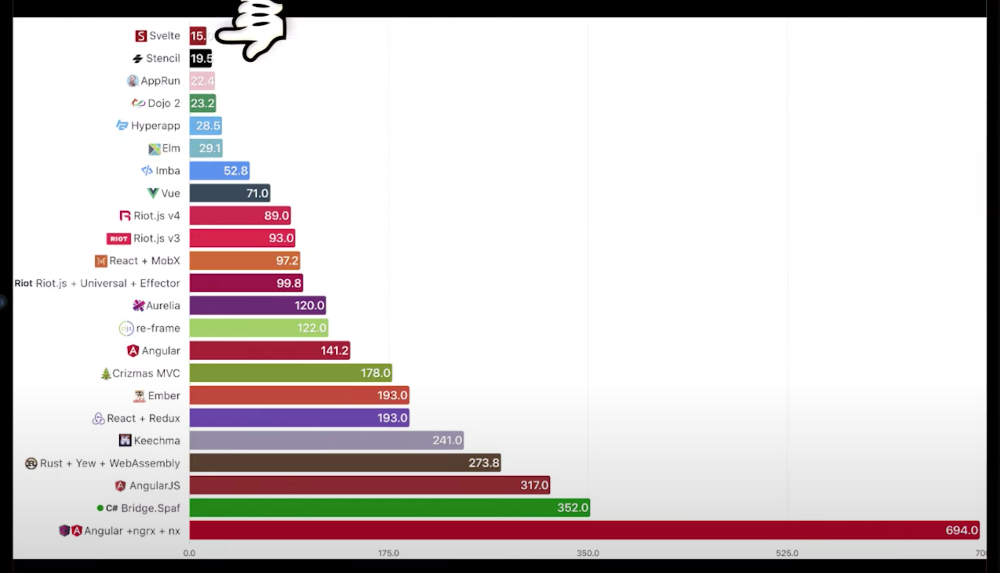

---

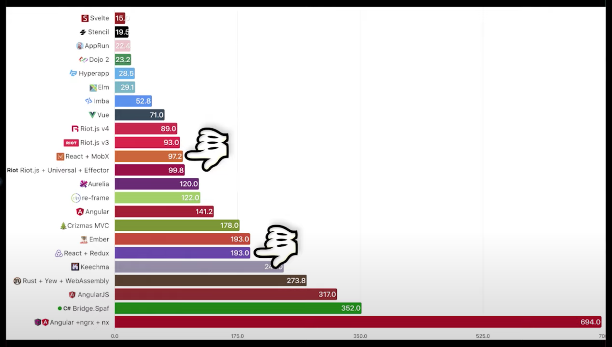

---

## :: React **vs.** Svelte

### 2. No virtual DOM!

- No Diffing
- No Overhead
- 빠른 성능

---

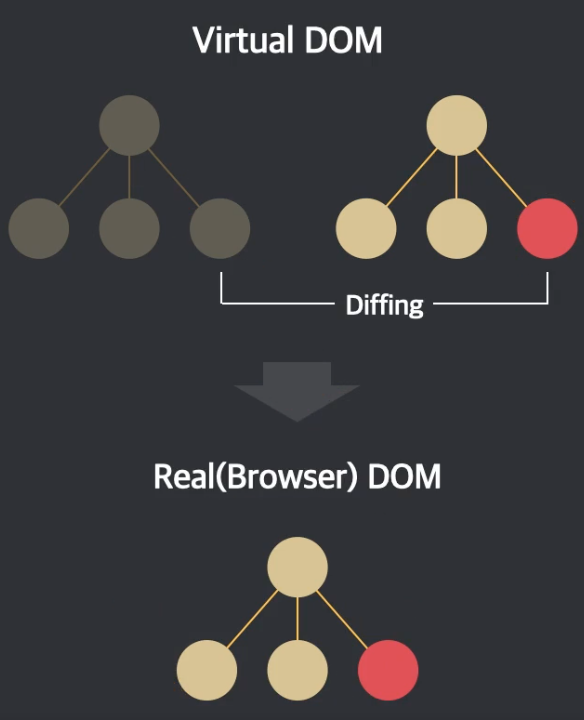

- **`Diffing`**: 기존에 만들어 놓은 가상 DOM과 변경된 상태를 기준으로 만든 가상 DOM을 비교해서 차이점을 찾아내는 과정

- 차이를 발견하면 차이가 있는 부분만 갱신 (전체 DOM을 모두 바꾸는 리소스가 크게 드는 행위를 안할 수 있음)

- Svelte에서는 가상 DOM을 생성하고 비교하는 과정이 없다. -> No Diffing (갱신만 한다)

---


- **`Overhead`**: 어떤 처리를 위해 들어가는 간접적인 시간이나 메모리 등을 말한다.

- 가상 DOM의 생성과 비교 등의 행위가 일어날 때 여러 리소스가 들어간다.

- Svelte는 바로 화면을 갱신 -> **No Overhead**

---


- 브라우저 환경(런타임)에서 No Diffing, No Overhead로 좋은 성능을 낸다. (메모리 절약)

- React에 비해 메모리 사용에서 2~4배 차이난다.

---

## :: React **vs.** Svelte

### Truly reactive (가상 DOM을 사용하지 않는 진정한 반응성)

- Framework-less Vanilla JS
- Only use `devDependencies`
- 명시적 설계(창의적 작업)

---

### Framework-less Vanilla JS

- 브라우저 환경(런타임)에서 가상 DOM을 사용하려면 React와 Vue를 브라우저 환경으로 가지고 와야한다. 이는 용량, 메모리, 시간이 들 수밖에 없다.(오버헤드 발생)

- Svelte 같은 경우 런타임에서 프레임워크가 사용되지 않는다. Svelte는 코드를 순수한 JS(Vanilla JS)로 결과물을 만들어서 브라우저에서 동작시킨다.

---

### Only use `devDependencies`

- Svelte 같은 경우 컴파일러 역할을 한다. -> 브라우저에 프레임워크가 포함되지 않는다.

- 그렇기 때문에 개발 의존성 모듈로만 외부 모듈을 설치해서 관리해도 잘 동작한다.

- Svelte가 작업물(애플리케이션)을 VanillaJS로 변환(컴파일)하고 그 결과만 동작하기 때문에 Svelte는 브라우저(런타임)에서 동작하지 않는 컴파일러라고 할 수 있다.

---

### 명시적 설계(창의적 작업)

- Svelte는 변수를 직접 변경하므로써 반응성을 가진다. (반응성을 직접적으로 명시)

- Svelte는 가상 DOM을 사용하지 않고 개발자가 작성해놓은 코드를 보고 언제 반응성이 일어나는지 미리 알 수 있으며 이를 바탕으로 순수한 JS로 결과물을 만들고 그 결과물을 브라우저에서 동작시킨다.

- 브라우저에서 동작하는 환경에 최적화하고 반응성도 유지할 수 있다.

> 반응성: 애플리케이션 상태(데이터)의 변화가, DOM에 자동으로 반영되는 현상을 말한다.

---

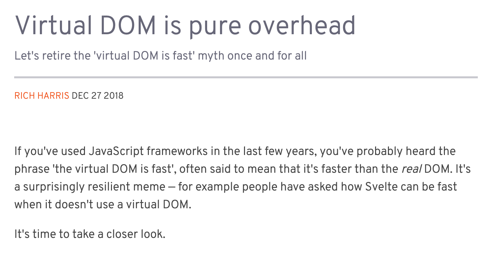

---

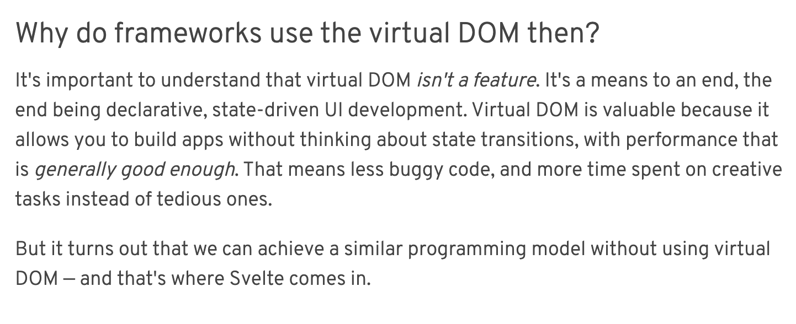

---

## :: Svelte 단점

- 낮은 성숙도(작은 생태계)

---

## :: React **vs.** Svelte

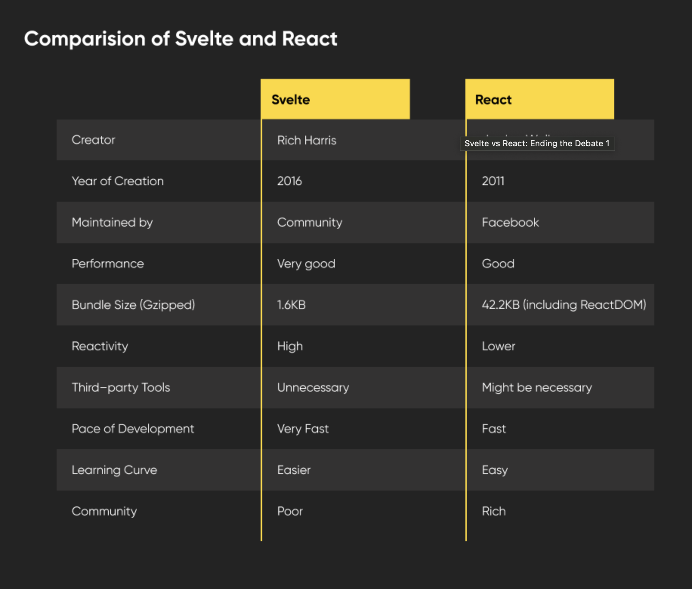

---

## :: 내가 느낀 Svelte

- 확실히 코드 치는 양과 시간이 주는 것 같다.
  - **양방향 바인딩** vs. 단뱡향 바인딩
  - 파이프

```html
<script>
  function handleClick() {
    alert("no more alerts");
  }
</script>

<button on:click|once="{handleClick}">Click me</button>
```

```html
<script>
  function handleClick() {
    console.log("success");
  }
</script>

<form on:submit|preventDefault="{handleClick}">
  <input placeholder="Name" />
  <button>submit</button>
</form>
```

```javascript
export default function Form() {
  function handleSubmit(event) {
    event.preventDefault();

    console.log("success");
  }

  return (
    <form onSubmit="{handleClick}">
      <input placeholder="Name" />
      <button>submit</button>
    </form>
  );
}
```

- 아직 큰 프로젝트는 해보지 않아서 인지 리액트가 느리다고 느껴본적은 없다.

- 외부 라이브러리를 찾아보면 참고할만한 라이브러리가 많지 않다.

- 참고할만한 좋은 코드를 많이 볼 수 없다.

- React는 상황이 바뀔 때 신호를 보내는 개발자에 의존합니다. 이는 Hook 코드를 많이 작성하는 것을 의미합니다.그러나 Hooks는 작성하기 쉽지 않고 많은 규칙이 포함되어 있으며 이러한 규칙은 코드베이스에 추가 인지 부하를 도입합니다.
